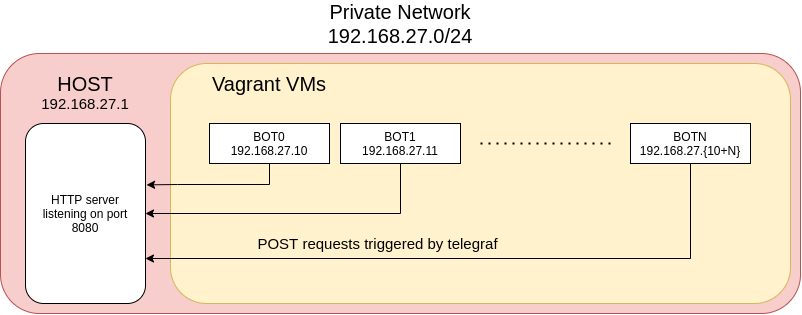
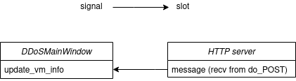

# DDoS attack & defense simulation 

### Prerequisites

To launch solutions in project, all listed tools are required:

- Python >= 3.6  
- VirtualBox >= 6.1.18
- Vagrant >= 2.2.18

#### Additional Prerequisites for developers 

- QtDesigner
- PySide `pip install requirements.txt`

### Observability Architecture

### GUI Signal / Slot Architecture

### Set up the environment

1. clone repo & `cd DDoS/`
2. In one terminal run `sudo vagrant up`
3. when command is done run `python3 main.py`
4. Done. You should see tiles with VMs system informations (CPU, memory, recv/send bytes).