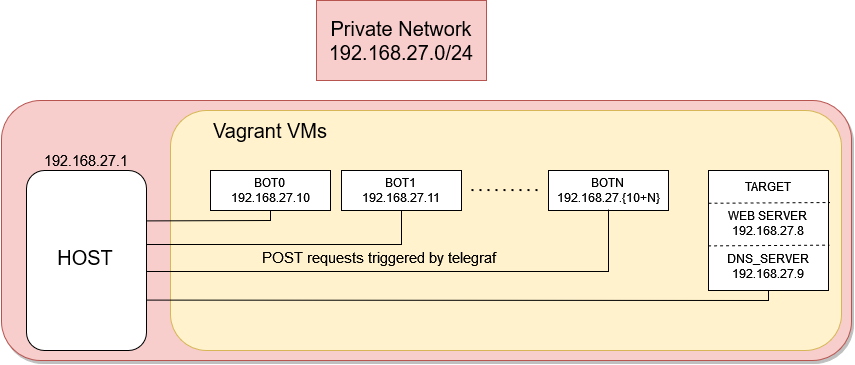

# DDoS attack&defense simulation 

## OBSERVABILITY

### Set up the environment observability 
1. Set up environment observability from [this](doc/observability.md) instruction
2. Done.

## ENVIRONMENT

### Environment - Prerequisites

To launch solutions in project, all listed tools are required:
- Python = 3.6  
- VirtualBox = 6.1.18
- Vagrant = 2.2.18
- Docker = 20.10.8

You can find them specified in requirements.txt. Setup script use this file as a list of technologies to be installed on your system. (administrator/sudo priviliges needed).

### Environment - Architecture

### [Windows] Setup environment
1. open Windows Powershell with administrator privilages
     - from repo root directory
     - go to repo root directory `cd <path>\DDoS`
2. run `.\setup-environment -attack_type <attack_type>`
    where <attack_type> can be:
      - '**syn_flood**'
      - '**dns_amplification**'
3. for more information run:
     - `get-help .\setup-environment`
     - `get-help .\setup-environment -examples`
4. Done.

### [Linux] Setup environment
1. open terminal
   - from repo root directory
   - go to repo root directory `cd <path>/DDoS`
2. run `sudo ./setup-environment -a <attack_type>`
    where <attack_type> can be:
      - '**syn_flood**'
      - '**dns_amplification**'
3. for more information run:
     `sudo ./setup-environment -h`
4. Done.

### [Any] Files woth to have a look:
1. `requirements.txt`   <- all required software which is going to be installed on your system
2. `shared_dir.txt`     <- list of directories to be mounted in /vagrant and reachable from every vagrant VM
3. `src/target.yml`     <- target machine resources declaration
