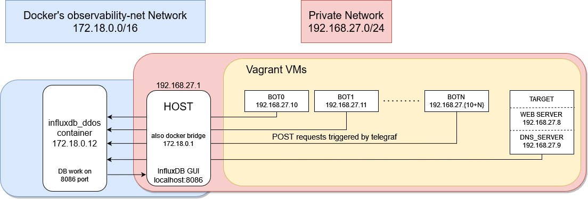

# DDoS Simulation Environment Observability

To work efficiently with machines it is higly recommended to use observability tools. Every machine shares status of their resources with _telegraf_ daemon (launched during startup in Vagrant).

### Observability - Prerequisites

Pull image with database 

`docker pull influxdb`

### Observability - Architecture

### Observability - Setting up

1. run `./setup-influx.sh`
2. when command is done open browser and enter URL [http://localhost:8086](http://localhost:8086/signin)
3. Log in with:
   1. username: ddos-user
   2. password: ddos-password

4. Go to **Boards**
5. Import two JSON boards
   1. ddos_all_bots_dashboard.json
   2. ddos_one_bot_dashboard.json
6. Done. Everything related to InfluxDB is done. Follow further steps on main [README](../README.md) so VMs would post data to database.

_We know, that the passwords are not so secure but in this case they are not meant to be._

### Observability - Cleanup
To get rid of all dockers&networks run
1. `docker kill influxdb_ddos`
2. `docker rm influxdb_ddos`
3. `docker network rm observability-net`
